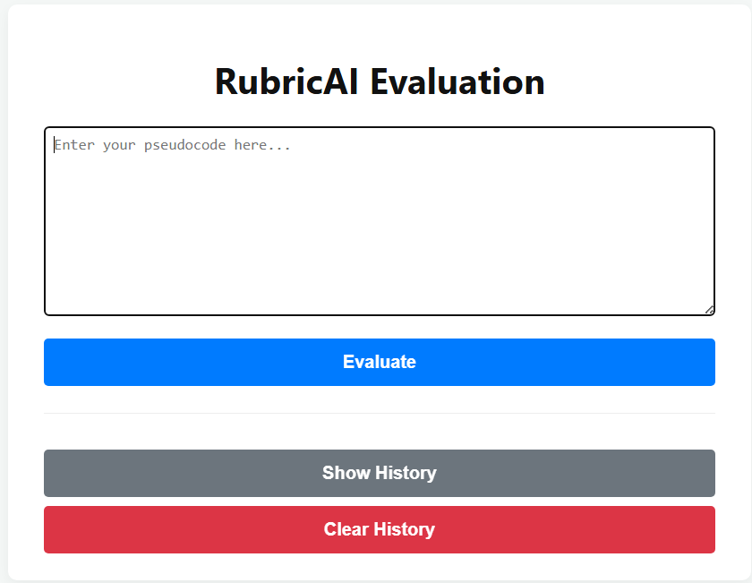
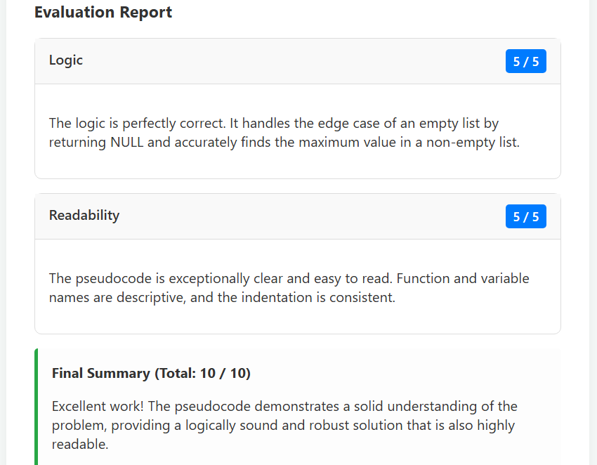
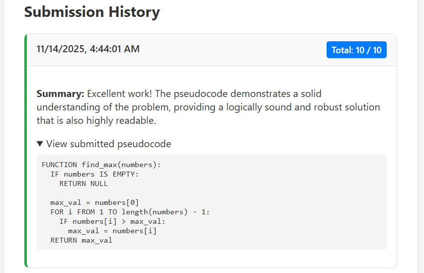

# RubricAI PseudoCode Evaluator


A lightweight toolkit made using Python, Flask and Gemini to automatically score student pseudocode against structured instructor rubrics — focused on interpretability, flexibility, and easy integration.





---

## Table of contents

- [Project status](#project-status)
- [Features](#features)
- [How it works (high-level)](#how-it-works-high-level)
- [Quickstart](#quickstart)
  - [Installation](#installation)
  - [CLI examples](#cli-examples)
  - [Python API examples](#python-api-examples)
- [Rubric format](#rubric-format)
- [Scoring heuristics & examples](#scoring-heuristics--examples)
- [Configuration & extending matchers](#configuration--extending-matchers)
- [Running tests](#running-tests)
- [Contributing](#contributing)
- [License](#license)

---

## Project status

Stable for core rule-based evaluation. Actively developed for structural matching and richer rubric syntaxes. Includes unit tests and example rubrics/submissions in `examples/`.

## Features

- Structured rubrics (JSON/YAML) with weights, required items, and tolerant matching.
- Multiple matchers: keyword, phrase, structure, regex, and extensible semantic matchers.
- Structural/heuristic partial credit and detailed per-item evidence.
- CLI for batch scoring and a Python API for embedding in pipelines or notebooks.

## How it works (high-level)

1. Load rubric (JSON/YAML) that defines items, points, and matchers.
2. Normalize the submission (tokenize, normalize identifiers, remove noise).
3. For each rubric item: run matcher → produce match boolean, confidence (0..1), and evidence snippets.
4. Aggregate item scores using weighting/partial-credit rules.
5. Emit itemized report (JSON/CSV/HTML) with evidence and feedback templates.

---

## Quickstart

### Requirements

- Python 3.8+
- Works on Linux, macOS, Windows

### Installation (local)

```bash
# create & activate venv
python -m venv .venv
# Linux / macOS
source .venv/bin/activate
# Windows (PowerShell)
.venv\Scripts\Activate.ps1

pip install -r requirements.txt
```

### CLI examples

Run batch evaluation:

```bash
python -m rubricai_evaluator.cli evaluate \
  --rubric examples/rubrics/sample_rubric.json \
  --submissions examples/submissions/ \
  --output reports/report.csv \
  --format csv --verbose
```

Single-file example:

```bash
python -m rubricai_evaluator.cli evaluate \
  --rubric examples/rubrics/sample_rubric.json \
  --submissions examples/submissions/student_001.txt \
  --output reports/student_001_report.json \
  --format json --verbose
```

### Python API examples

```python
# from rubricai_evaluator import Evaluator
# ev = Evaluator(rubric_path="examples/rubrics/sample_rubric.json")
# report = ev.evaluate_text(student_text)
# print(report.summary())
```

---

## Rubric format

Each rubric item supports:

- id (string)
- name (string)
- description (string)
- max_points (number)
- required (bool, optional)
- matcher (type + config)
- partial_credit (optional rules)

Matcher types: keyword, phrase, structure, regex, semantic (extensible).

---

## Scoring heuristics & examples

- Binary matches: full points when confident.
- Partial matches: points = max_points \* confidence (0..1).
- Required items: configurable penalties or zeroing behavior.
- Aggregation: default is summed then optionally normalized.

### Sample pseudocode examples

Perfect submission (should score highly):

```text
FUNCTION find_max(numbers):
  IF numbers IS EMPTY:
    RETURN NULL

  max_val = numbers[0]
  FOR i FROM 1 TO length(numbers) - 1:
    IF numbers[i] > max_val:
      max_val = numbers[i]
  RETURN max_val
```

Good logic, poor readability:

```text
FUNCTION doit(x):
  IF length(x) == 0:
    RETURN 0

  v = x[0]
  FOR i FROM 1 TO length(x) - 1:
    IF x[i] > v:
      v = x[i]
  RETURN v
```

Good readability, bad logic:

```text
FUNCTION calculate_sum(array_of_numbers):
  total = 1  // BUG: Should be 0
  FOR i FROM 0 TO length(array_of_numbers) - 2:  // BUG: skips last
    total = total + array_of_numbers[i]
  RETURN total
```

Broken reverse example:

```text
FUNCTION reverse_it(string_one):
  string_two = ""
  FOR i FROM 0 TO length(string_one) - 1:
    string_two = string_two + string_one[i]
  RETURN string_two
```

---

## Important rubric fields (compact)

- id — unique identifier
- name — short title for reports
- description — grader guidance / feedback template
- max_points — points available
- required — if true, missing can trigger penalties
- matcher — detection strategy (keyword/phrase/structure/regex/semantic)
- partial_credit — rules for partial scoring

---

## Configuration & extending matchers

- Add custom matchers under `rubricai_evaluator/matchers/` implementing:
  match(submission_text, matcher_config) -> MatchResult
- Add synonyms in `config/` or include them inline in matcher configs.
- ML-based matchers: wrap your embeddings/classifier and register as `semantic`.

---

## Diagnostics & logs

- Use `--verbose` for per-item logs in CLI.
- Set `RUBRICAI_LOG=debug` for debug output.
- JSON reports include evidence snippets (matched indices + context).

---

## Running tests

If a `tests/` directory exists:

```bash
pytest -q
# Or: pip install pytest && pytest -q
```

---

## Contributing

1. Fork → branch → implement → tests → PR.
2. Add tests for new behavior.
3. Follow existing code style.

Preferred areas: new matchers, structural parser improvements, tokenization, performance, UI integrations.

---

## Contact & support

Repo: https://github.com/Aafi04/RubricAI-PseudoCode-Evaluator  
Open an issue for bugs, features, or integration help. ;)
